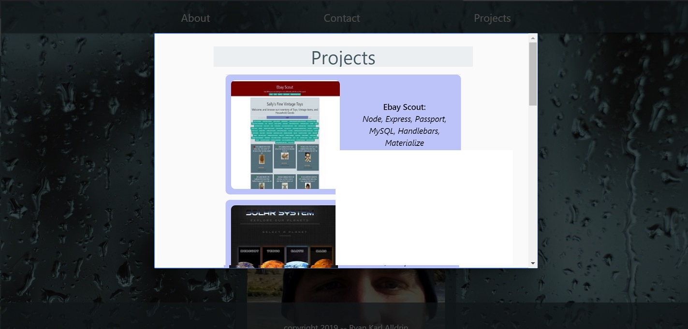

# Portfolio

#### About:
This is my personal homepage, where you can find a bit of information about me, a few pictures, and a sampling of projects I have done.  I built it with HTML, Materialize, and a bit of CSS and I am happy with how it all came together.

[See it Live](https://akaryrye.github.io/Portfolio/)

#### Installation:

HTTPS:   `$ Git Clone https://github.com/akaryrye/Portfolio.git`

SSH:   `$ Git Clone git@github.com:akaryrye/Portfolio.git`

Then, simply open index.html in your browser.

#### Technologies:
HTML, CSS, Materialize

#### Author:
Ryan K Alldrin

Thank you for checking it out and I hope you enjoyed this!
